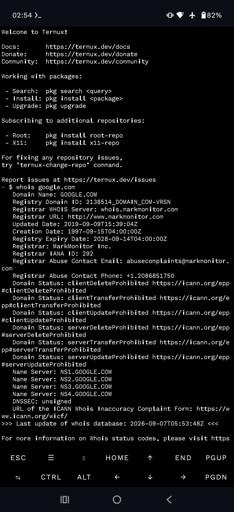

# [Lab 01] SOC Fundamentals - Google Cybersecurity Certificate


> **Objetivo:** Documentar meu aprendizado prático do Curso 1 do Google Cybersecurity com foco na rotina de um SOC L1: triagem de alertas e investigação de domínios suspeitos.
> **Diferencial:** Laboratório 100% executado via celular no Termux.

### 👤 Sobre Mim | Jamerson Dantas
Estudante de Cybersecurity com foco em **Blue Team / SOC N1**, em busca da primeira oportunidade na área. Rotina de estudos de 2h/dia.

**Meu Setup de Estudos:** Motorola Edge 70 Fusion + Termux + GitHub Mobile + TryHackMe + LetsDefend

**Links:** [LinkedIn](https://www.linkedin.com/me?trk=p_mwlite_feed-secondary_nav) | [TryHackMe](https://tryhackme.com/p/jamersondantasdossantos) | [LetsDefend](https://app.letsdefend.io/user/Jammex)

---
### 📚 1. O Que Aprendi e Como Apliquei

#### Conceitos Chave do Curso 1:
- **CIA Triad (Confidencialidade, Integridade, Disponibilidade):** Usei para classificar o impacto. Ex: domínio de phishing que rouba senha = quebra de Confidencialidade.
- **NIST CSF (Identify, Protect, Detect, Respond, Recover):** Entendi que o SOC L1 atua principalmente em **Detect & Respond**.
- **SOC, SIEM, Playbooks:** Entendi a fila de alertas. SIEM (Ex: Chronicle, Splunk) coleta os logs e o Playbook é o passo-a-passo que o analista segue.

> **Minha maior lição do curso:** O analista de SOC N1 não precisa saber hackear tudo. Ele precisa saber identificar o que é normal e o que é suspeito nos logs e seguir o playbook sem pânico.

---
### 🟢 2. Laboratório Prático - TryHackMe

**Plataforma:** TryHackMe - Path: Pre-Security
**Salas Concluídas:** `Introduction to Cybersecurity` | `Principles of Security (CIA Triad)`

**Investigação Realizada:**
Análise de um domínio suspeito para identificar possível phishing.

**Comando executado no Termux:**
`whois google.com
Objetivo: Ver data de criação para diferenciar domínio legítimo de domínio recém-criado de phishing`

O Que Eu Descobri:
• Domínios legítimos como google.com têm data de criação antiga (1997) • Domínios de phishing geralmente têm poucos dias de vida. Essa checagem é o primeiro passo no enriquecimento de um alerta de SOC. 
Evidência:


🔵 3. Laboratório Prático - LetsDefend (Simulação de SOC Real)
Plataforma: LetsDefend - SOC Analyst Learning Path
Módulo: What is SOC?

Alerta Analisado: SOC001 - Suspicious Domain Detected

1. Triagem e Enriquecimento (Enrichment):
• Verifiquei o domínio no WHOIS: Criado há 2 dias • Verifiquei no VirusTotal: 5/90 engines detectaram como malicioso • Contexto: Domínio com nome parecido com marca famosa (typosquatting) 
2. Veredito: True Positive - Tentativa de Phishing

3. Ação Recomendada (Seguindo o Playbook L1):
• [ ] Bloquear domínio no Firewall / DNS Filter • [ ] Isolar o host que tentou acessar o domínio • [ ] Escalar para o time L2 com todas as evidências anexadas 
O que aprendi: Como funciona uma fila de alertas de um SOC real e a importância de documentar tudo.

🐧 4. Meu Lab Linux - Comandos no Termux
Comandos que pratiquei e valido para rotina de SOC:
# Investigação de Domínio e Rede
```bash
whois dominio-suspeito.com
nslookup dominio-suspeito.com
ping -c 4 8.8.8.8
ip a
```

# Navegação Essencial no Linux
pwd
ls -la
cat arquivo.log
whois --help

🛠️ Ferramentas Utilizadas
Termux Linux WHOIS VirusTotal LetsDefend TryHackMe Google Chronicle (Teoria)
🎯 Próximos Passos 
• [ ] Curso 2 do Google: Playbooks, SIEM e Gestão de Incidentes 
• [ ] Concluir o path SOC Level 1 do TryHackMe 
• [ ] Aprender KQL para Microsoft Sentinel 
📜 Certificação
[https://www.coursera.org/account/accomplishments/verify/DJGJW94CB0P9?utm_source%3Dandroid%26utm_medium%3Dcertificate%26utm_content%3Dcert_image%26utm_campaign%3Dsharing_cta%26utm_product%3Dcourse]

Feito por Jamerson Dantas - Futuro SOC Analyst L1
