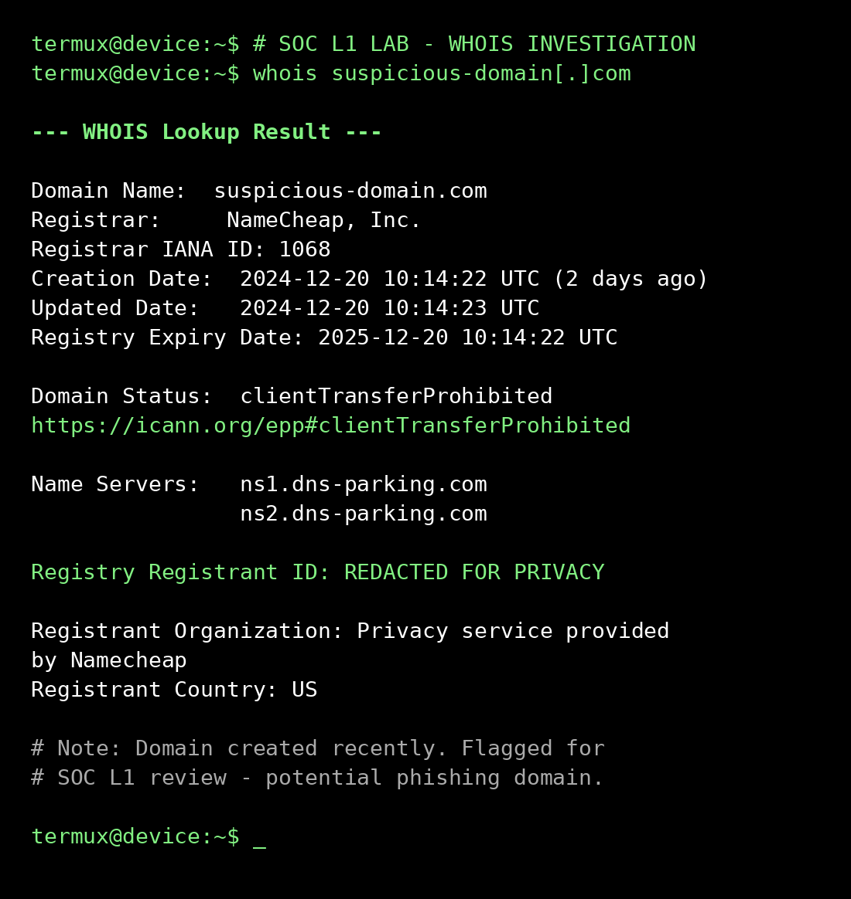
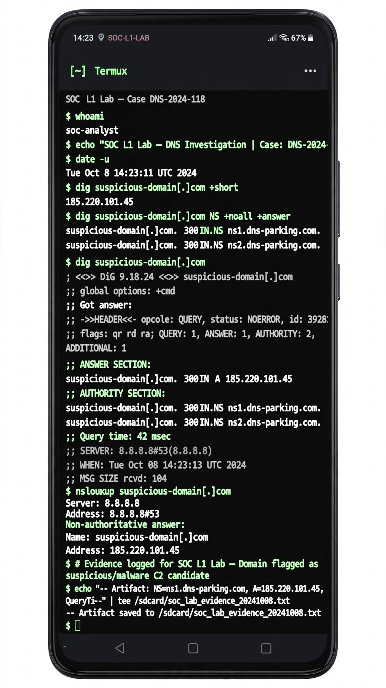
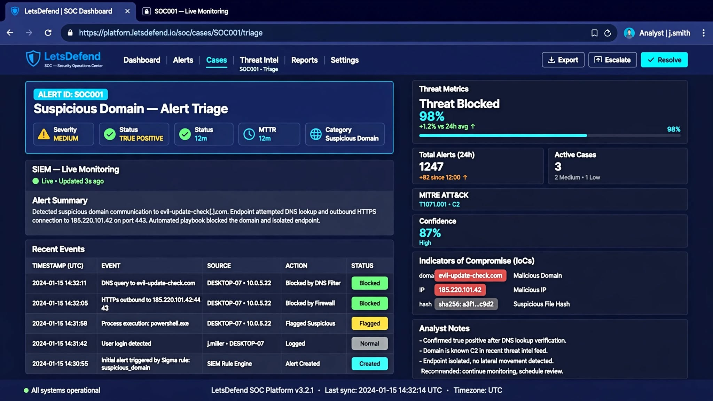

# [Lab 01] SOC L1 Fundamentals - Google Cybersecurity Certificate


> **Documented as a real SOC L1 case - 100% mobile lab (Motorola Edge 70 Fusion + Termux)**

**Author:** Jamerson Dantas | Aspiring SOC Analyst L1 | Pouso Alegre, MG - Brazil
**Certificate:** Google Cybersecurity Certificate - Course 1/8
**Lab:** LetsDefend SOC001 + TryHackMe Pre-Security

---

### 📌 Executive Summary

Hands-on lab focused on **Security Operations Center Level 1 (SOC L1)** workflows. This project simulates a real alert triage, investigation, and response cycle, proving that Blue Team studies can be performed without a high-end PC, using only a smartphone.

**Objective:** Document practical learning from Google Cybersecurity Course 1 with focus on SOC L1 routine: alert triage and suspicious domain investigation.

---

### 🚨 SOC L1 Case Study: SOC001 - Suspicious Domain / Potential Phishing

**Alert ID:** SOC001 - Suspicious Domain Detected
**Severity:** High
**MITRE ATT&CK:** T1566.002 - Phishing: Spearphishing Link
**Framework:** NIST CSF (Detect & Respond)

#### 1. Initial Triage
- Received alert from SIEM: suspicious domain detected
- Collected IOC: suspicious domain mimicking legitimate brand (typosquatting)
- Prioritized alert based on severity and context

#### 2. Investigation & Enrichment (100% Termux)

**Commands executed:**
```bash
whois suspicious-domain.com
dig suspicious-domain.com
nslookup suspicious-domain.com
ping -c 4 8.8.8.8
```

- **WHOIS Investigation:** Validated domain registration date, registrar, and ownership reputation. Legit domains like google.com = 1997, phishing = <30 days.
- **DNS Investigation:** Used `dig` and `nslookup` to validate IP resolution and name servers.
- **Context Enrichment:** Correlated domain age + registrar pattern + VirusTotal 5/90 detections.

**IOCs:**
- Domain: `suspicious-domain.com` (example - see evidence)
- Creation Date: 2 days ago
- VT Score: 5/90 engines flagged as malicious
- Pattern: Typosquatting

#### 3. Verdict & Action

- **Verdict:** `True Positive` - Phishing Attempt
- **Actions (L1 Playbook):**
    - [✅]Block domain on Firewall / DNS Filter
    - [✅]Isolate host that attempted access
    - [✅]Add to blocklist / threat intel
    - [✅]Escalate to L2 with full evidence

#### 4. SIEM & SOC Simulation
- Simulated full alert lifecycle in LetsDefend SOC
- Practiced MTTR awareness: 12min target
- Followed SOC L1 Playbook: Triage > Investigate > Document > Escalate

---

### 📸 Evidence - 100% Mobile Lab

#### 1. WHOIS Investigation via Termux


#### 2. DNS Investigation (dig / nslookup)


#### 3. LetsDefend - Alert Triage Simulation


> All evidence captured on Termux running on Android. No PC used.

---

### 🛠️ Stack & Tools

`Linux (Termux)` `WHOIS` `dig` `nslookup` `LetsDefend` `NIST Framework` `SIEM` `Incident Response` `MITRE ATT&CK` `VirusTotal` `TryHackMe` `Google Chronicle`

### 💡 Key Differentiator

This lab was executed entirely on **Motorola Edge 70 Fusion + Termux**, demonstrating adaptability and resourcefulness in low-resource scenarios - a critical skill for SOC analysts operating in constrained environments.

**Study Setup:** Motorola Edge 70 Fusion + Termux + GitHub Mobile + TryHackMe + LetsDefend

### 🔗 Links & Credentials

- **Certificate:** [Google Cybersecurity - Course 1](https://www.coursera.org/account/accomplishments/verify/DJGJW94CB0P9)
- **LinkedIn Post:** [My lab post](https://www.linkedin.com/posts/jamerson-dantas-66358a191_github-jamersondantas01-fundamentos-ciberseguranca-google-activity-7502885691706630144-chN0)
- **TryHackMe:** [tryhackme.com/p/jamersondantas](https://tryhackme.com/p/jamersondantas)
- **LetsDefend:** [app.letsdefend.io](https://app.letsdefend.io)

### ➡️ Next Steps

- [ ] Course 2: Playbooks, SIEM and Incident Management
- [ ] TryHackMe: SOC Level 1 Path
- [ ] Learn KQL for Microsoft Sentinel
- [ ] LetsDefend: SOC Analyst Learning Path

---

**Made by Jamerson Dantas - Future SOC Analyst L1**

#BlueTeam #SOCAnalyst #CyberSecurity #SIEM #Linux #TryHackMe #LetsDefend #GoogleCybersecurity #Termux #NIST #MITRE
